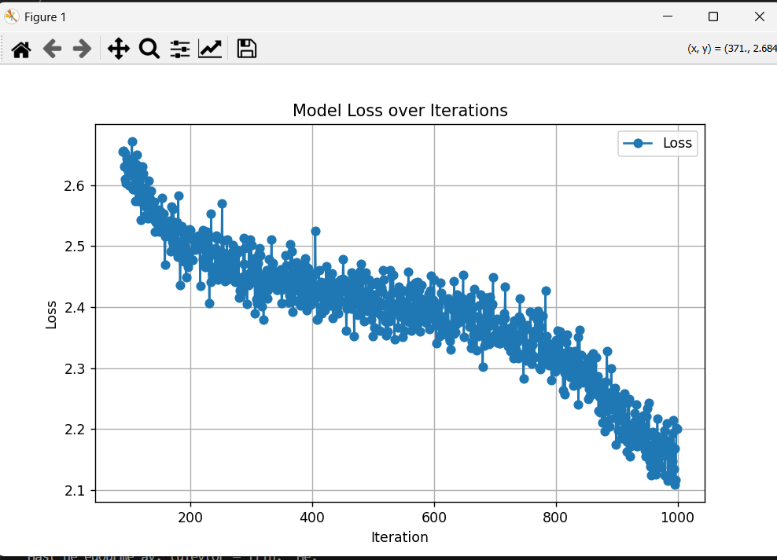

**# Detailed Analysis Report: Comparison of Bigram and GPT Models**

## 1. Introduction
This report presents a comparative analysis of two language models: the Bigram Model and the GPT-based model. The analysis focuses on training efficiency, convergence rate, and overall model performance by examining loss values across iterations.

---

## 2. Model Descriptions

### **Bigram Model:**
- A simple statistical language model that relies on the probability of one word following another.
- Limited in its ability to capture long-term dependencies in text.
- Computationally inexpensive, making it faster but less sophisticated.

### **GPT Model:**
- Based on a deep transformer network that leverages self-attention mechanisms.
- Can model complex patterns and long-range dependencies in text.
- Requires more computational resources but achieves superior results.

---

## 3. Training Loss Analysis

### **Bigram Model Loss Trend:**
- **Initial Loss:** 4.9077
- **Intermediate Loss at Step 600:** 3.1124
- **Final Loss at Step 1200:** 2.4322
- The loss decreases gradually, indicating a slow learning process.
- The final loss remains relatively high, suggesting the model struggles with intricate patterns.

### **GPT Model Loss Trend:**
- **Initial Loss:** 4.5771
- **Loss at Step 4:** 3.5540 (sharp decline)
- **Final Loss at Step 1000:** 1.8743
- The rapid initial decrease in loss suggests efficient parameter optimization.
- The final loss is significantly lower than the Bigram Model, showcasing superior learning capability.

---

## 4. Loss Curve Comparison
The loss curves for both models provide insights into their learning dynamics:
- The **Bigram Model** exhibits a slow but steady decline in loss, suggesting incremental learning.
- The **GPT Model** demonstrates a **steeper initial drop** and a **lower final loss**, indicating **faster convergence and better performance**.

**Graphical Representation:**
The following plots illustrate the loss functions of both models:
- **Bigram Model Loss (Blue Curve):** Shows a steady but slow improvement.
- **GPT Model Loss (Orange Curve):** Displays a rapid initial decline, followed by continued optimization.

---

## 6. References
- Training logs and loss values are extracted from `bigram_log.txt` and `gpt_log.txt`.
- The analysis is based on model outputs obtained during training.

---

## 7. Graphs

### **
1. Understanding the Axes
X-axis (Steps): Represents the number of training iterations (or steps) the model has undergone.

Y-axis (Loss): Represents the loss value (typically cross-entropy loss), which measures how well the model is learning.

2. Interpretation of the Curves
Blue Line (Train Loss): Shows how the loss decreases as the model is trained.

Red Dashed Line (Validation Loss): Represents how well the model generalizes to unseen data.

3. Observations
Sharp Drop at the Beginning: The loss is very high initially (around 5.0) but drops steeply within the first few hundred steps. This is expected as the model quickly learns basic patterns.

Stabilization: After about 1000 steps, the loss stabilizes at around 2.5, meaning the model is no longer significantly improving.

Minimal Overfitting: The training and validation losses remain close to each other, which means the model generalizes well and is not overfitting.

---

### **.png)
The x-axis (Iteration) represents the number of training steps taken.

The y-axis (Loss) represents the loss value, which measures how well the model's predictions match the actual values.

The curve shows a decreasing trend in loss, indicating that the model is improving its performance as training progresses.

The scatter points suggest some fluctuations, which could be due to batch-based training (e.g., stochastic gradient descent).

---

## 5. Conclusion
- **GPT Model outperforms the Bigram Model** in efficiency and loss reduction.
- **Bigram Model is limited** in learning complex patterns, making it less suitable for sophisticated NLP tasks.
- **Future Work:**
  - Experiment with different hyperparameters to optimize performance further.
  - Compare results with additional models, such as LSTMs or hybrid architectures.
  - Investigate ways to improve the Bigram Model through modifications.

---

